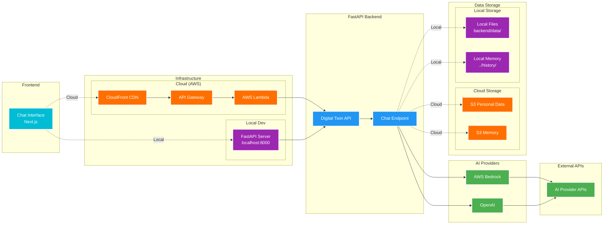

# Digital Twin AI

An AI-powered digital twin that mimics your communication style, knowledge, and personality. Built with FastAPI, Next.js, and AWS Bedrock.

## What is this?

This application creates a conversational AI that represents you. It learns from your personal data (LinkedIn profile, facts about you, communication style) and responds to questions as if it were you. Think of it as your digital representative that can answer questions about your background, experience, and expertise.

## How it works

The application consists of:
- **Backend**: FastAPI server that uses AWS Bedrock (Nova models) to generate responses based on your personal data
- **Frontend**: Next.js chat interface where users can interact with your digital twin
- **Data Layer**: Your personal information (LinkedIn PDF, facts, style guide) that personalizes the AI

When someone asks a question, the AI references your personal data to craft responses that sound like you and contain accurate information about you.

## Architecture

The Digital Twin uses a modern architecture with multiple AI providers and flexible deployment options:



**Key Features:**
- **Flexible deployment** - Cloud (AWS serverless) or Local development
- **Real-time responses** from AI providers
- **Multi-AI provider** support (AWS Bedrock, OpenAI)
- **Adaptive data storage** - S3 for cloud, local files for development
- **Security controls** and validation

📖 For detailed architecture information and deployment guide, see **[Architecture & Deployment](docs/ARCHITECTURE.md)**.

## Data Management

### Current Setup (Separate Private Repo)

This project is currently configured to keep personal data separate from the main codebase. Personal data is stored in a private repository and encrypted for deployment.

### Alternative: Local Data Approach

A simpler local approach by committing personal data to `backend/data` directory:

1. **Copy the templates** from `backend/data/personal_data_templates/` to `backend/data/personal_data/`
2. **Edit the files** with your actual information:
   - `facts.json` - Structured facts about you
   - `summary.txt` - Personal summary
   - `style.txt` - Your communication style
   - `linkedin.pdf` - Your LinkedIn profile as PDF
   - `me.txt` - Additional personal description (optional)

3. **Copy prompt templates** from `backend/data/prompts_template/` to `backend/data/prompts/`

**Quick setup command**:
```bash
./scripts/setup-local-data.sh
```

📖 For detailed information about data files, formats, and the data loader system, see the **[Data Guide](backend/data/DATA_ARCHITECTURE.md)**.

## Customization

### Avatar

To use your own avatar image:

1. Replace the avatar file in `frontend/public/avatar.png` with your own image
2. Recommended size: 200x200px or larger (square aspect ratio)
3. Supported formats: PNG, JPG, or any web-compatible image format

The avatar will automatically appear in the chat interface.

### Personalize Names and Text

Edit `frontend/app/page.tsx` to customize:
- Digital twin name (default: "Luna")
- Your name and title
- Header and footer text

## Getting Started - Local Development

⚠️ **Cost Warning**: Local development using OpenAI will incur API costs based on your usage. OpenAI charges per token (input/output). Monitor your usage at [OpenAI's usage dashboard](https://platform.openai.com/usage). Alternatively, you can use AWS Bedrock which also has associated costs.

### Prerequisites
- Python 3.11+
- Node.js 18+
- OpenAI API key (or AWS credentials for Bedrock)

### Setup Steps

1. **Install dependencies**:
```bash
# Backend
cd backend
uv sync

# Frontend
cd frontend
npm install
```

2. **Set up your personal data** (see Data Management section above)

3. **Configure environment variables** (optional):

For local development, you can use OpenAI instead of AWS Bedrock. Copy the example environment file and configure it:

```bash
cd backend
cp .env.example .env
# Edit .env and set AI_PROVIDER=openai and your OPENAI_API_KEY
```

See `backend/.env.example` for all available configuration options.

4. **Start the backend** (Terminal 1):
```bash
cd backend
uv run server.py
```
Backend runs on `http://localhost:8000`

5. **Start the frontend** (Terminal 2):
```bash
cd frontend
npm run dev
```
Frontend runs on `http://localhost:3000`

### Test Your Local Setup

1. Open your browser to `http://localhost:3000`
2. You should see the chat interface with your avatar
3. Start chatting with your digital twin!

---

## Cloud Deployment

⚠️ **Cost Warning**: Deploying to AWS will incur cloud infrastructure costs that are your responsibility. See the **[Cost Disclaimer](docs/ARCHITECTURE.md#cloud-deployment-guide)** section in the architecture guide for details.

Willing to deploy to AWS? See the **[Architecture & Deployment Guide](docs/ARCHITECTURE.md)** for instructions. Once setup:

**Quick deploy:**
```bash
./scripts/deploy.sh dev
```

---

## Project Structure

```
digital-twin/
├── backend/           # FastAPI backend
│   ├── app/          # Application code
│   ├── data/         # Personal data and prompts
│   └── tests/        # Backend tests
├── frontend/         # Next.js frontend
│   ├── app/          # Next.js app directory
│   └── components/   # React components
├── terraform/        # Infrastructure as Code
├── scripts/          # Deployment and utility scripts
└── docs/            # Documentation
```


---

## License

See [LICENSE](LICENSE) file for details.

---

**More screenshots and documentation coming soon...**
