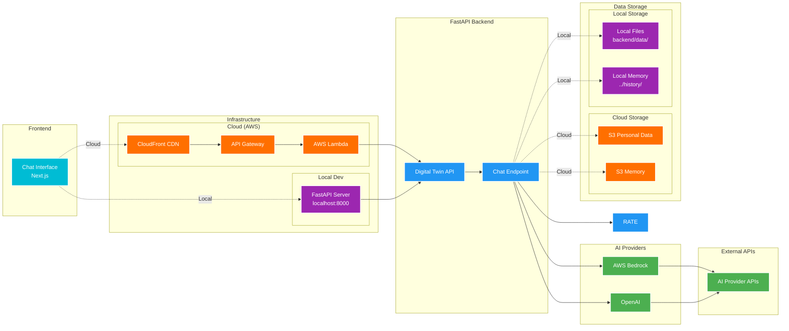

# Digital Twin Architecture & Deployment Guide

This document covers the system architecture and cloud deployment of the Digital Twin AI application.

---

## System Architecture

### Overview

The Digital Twin is a sophisticated AI-powered chatbot system built for professional representation. It combines a modern web frontend with a serverless backend, leveraging multiple AI providers and comprehensive data management.

### Architecture Diagram

The Digital Twin uses a unified architecture that supports both cloud deployment and local development:



### Key Components

#### 1. Frontend Layer (Next.js)
- **React-based chat interface** with real-time streaming
- **Theme toggle** for dark/light mode
- **Avatar component** for personalization
- **Server-Sent Events (SSE)** for live response streaming

#### 2. Backend Layer (FastAPI)
- **RESTful API** with streaming chat endpoint
- **Modular service architecture** with dependency injection
- **Rate limiting, authentication** (Cognito-ready), and structured logging
- **Multiple deployment modes** (local development, serverless)

#### 3. AI Services (Multi-Provider)
- **Abstract factory pattern** supporting AWS Bedrock, OpenAI, and Ollama
- **Streaming and non-streaming** response modes
- **Conversation history management** with configurable limits
- **Provider-agnostic interface** for easy switching

#### 4. Memory System
- **Pluggable backends** (S3 for production, local for development)
- **Session-based conversation persistence**
- **JSON-formatted message storage** with timestamps

#### 5. Data Management
- **Comprehensive personal data loading** system with caching
- **Structured data files** (JSON, YAML, TXT, PDF, Markdown)
- **Prompt management system** for AI instructions
- **Template-based setup** for easy customization

#### 6. AWS Infrastructure
- **Serverless deployment** with Lambda and API Gateway
- **CloudFront CDN** with optional custom domain support
- **S3 buckets** for static hosting and conversation storage
- **Terraform Infrastructure as Code** for reproducible deployments

### Data Flow

1. **User Input**: User types message in React frontend
2. **API Request**: Frontend sends POST to `/chat` endpoint via API Gateway
3. **Authentication & Rate Limiting**: Optional auth check and rate limit validation
4. **AI Processing**:
   - Load conversation history from memory service
   - Load personal data and prompts
   - Send to selected AI provider (Bedrock/OpenAI/Ollama)
5. **Response Streaming**: AI response streamed back via SSE
6. **Memory Storage**: Conversation saved to S3 or local storage
7. **Frontend Update**: Real-time response display in chat interface

### Security Features

- **Rate limiting** with sliding window algorithm
- **Input validation** and content filtering
- **Optional authentication** (Cognito integration ready)
- **CORS configuration** for cross-origin requests
- **Encrypted data storage** in S3
- **IAM role-based permissions** for AWS resources

---

## Cloud Deployment Guide

⚠️ **Cost Disclaimer**: Deploying this application to AWS will incur cloud infrastructure costs. These costs are the responsibility of the user and will be charged to your AWS account.

### Prerequisites

#### AWS IAM User Setup

⚠️ **IMPORTANT: Do NOT use the AWS root user for these operations!**

1. **Create an IAM user** (not root) with appropriate permissions
2. **Configure AWS CLI** with this IAM user's credentials

**Required IAM Permissions:**
- S3: Full access (for frontend hosting, data storage, and Terraform state)
- Lambda: Full access (for backend function deployment)
- API Gateway: Full access (for HTTP API)
- CloudFront: Full access (for CDN distribution)
- IAM: Create and manage roles/policies (for Lambda execution role)
- Route53: Manage DNS records (optional, for custom domains)
- ACM: Manage SSL certificates (optional, for custom domains)
- DynamoDB: Create and manage tables (for Terraform state locking)

**Configure AWS CLI:**
```bash
aws configure
# Enter your IAM user's Access Key ID
# Enter your IAM user's Secret Access Key
# Default region: eu-central-1 (or your preferred region)
# Default output format: json
```

#### AWS Terraform Backend Setup

**One-time setup per AWS account** for remote state management:

```bash
# Create S3 bucket for Terraform state
AWS_ACCOUNT_ID=$(aws sts get-caller-identity --query Account --output text)
aws s3 mb s3://digital-twin-terraform-state-${AWS_ACCOUNT_ID} --region eu-central-1

# Enable versioning
aws s3api put-bucket-versioning \
  --bucket digital-twin-terraform-state-${AWS_ACCOUNT_ID} \
  --versioning-configuration Status=Enabled \
  --region eu-central-1

# Create DynamoDB table for state locking
aws dynamodb create-table \
  --table-name digital-twin-terraform-locks \
  --attribute-definitions AttributeName=LockID,AttributeType=S \
  --key-schema AttributeName=LockID,KeyType=HASH \
  --billing-mode PAY_PER_REQUEST \
  --region eu-central-1
```

### Deployment Methods

#### Standard Deployment (with encrypted private repo)

Deploy to AWS using Terraform:

```bash
./scripts/deploy.sh dev
```

**Available environments:**
- `dev` - Development environment
- `test` - Testing environment
- `prod` - Production environment

#### Local Data Deployment

If you're using local data (not the private repo approach):

```bash
./scripts/deploy.sh --use-local dev
```

### What Gets Created

**Core Infrastructure:**
- **Lambda Function**: Python FastAPI backend with AWS Bedrock integration
- **API Gateway**: HTTP API endpoint for backend communication
- **S3 Buckets**: Frontend hosting, personal data storage, conversation memory
- **CloudFront Distribution**: Global CDN for fast frontend delivery
- **IAM Roles**: Lambda execution role with necessary permissions

**Optional Resources (for production):**
- **Route53 Records**: DNS records for custom domain
- **ACM Certificate**: SSL/TLS certificate for HTTPS

### Post-Deployment

After successful deployment:

```
✅ Deployment complete!
============================================
🌐 CloudFront: https://d1234567890.cloudfront.net
🔗 Custom domain: https://your-domain.com (if configured)
```

### Cleanup

To remove all deployed resources:

```bash
./scripts/destroy.sh dev  # or test/prod
```

### Cost Optimization

The serverless architecture is cost-effective:
- **Lambda**: Pay per request (free tier: 1M requests/month)
- **S3**: Pay for storage and transfer (minimal for small sites)
- **CloudFront**: Pay per request and data transfer
- **API Gateway**: Pay per request (free tier: 1M requests/month)

**Estimated monthly cost** for low-traffic usage: $5-10/month

---

## Troubleshooting

### Common Issues

**"Terraform state bucket not found"**
- Make sure you've run the Terraform backend setup steps
- Verify bucket name matches: `digital-twin-terraform-state-<account-id>`

**"Access Denied" errors**
- Check your IAM user permissions
- Run `aws sts get-caller-identity` to verify you're using the correct user
- Ensure you're not using the root user

**Frontend not updating after deployment**
- CloudFront cache may need to be invalidated
- The deployment script handles this automatically

**API Gateway 403 errors**
- Check CORS configuration in `backend/app/core/config.py`
- Verify `CORS_ORIGINS` environment variable

### Getting Help

For additional help:
- Check the [main README](../README.md) for local development setup
- Review Terraform logs: `cd terraform && terraform plan`
- Check AWS CloudWatch logs for Lambda errors

---

## Security Considerations

### API Gateway Access Control
- Rate limiting is configured in the backend application
- The API URL is not publicly displayed to reduce exposure

### Data Protection
- Personal data in S3 is encrypted at rest (AES256)
- Terraform state is encrypted in S3
- Use separate AWS accounts for dev/prod for isolation
- Regularly rotate AWS credentials

### Monitoring
Enable CloudWatch alarms for:
- Unusual API request patterns
- Lambda errors
- High data transfer costs
- Failed authentication attempts
